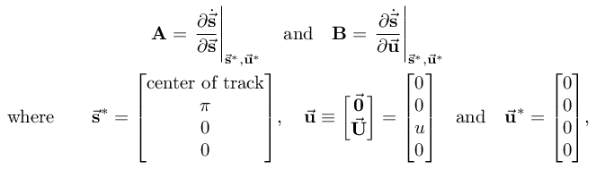
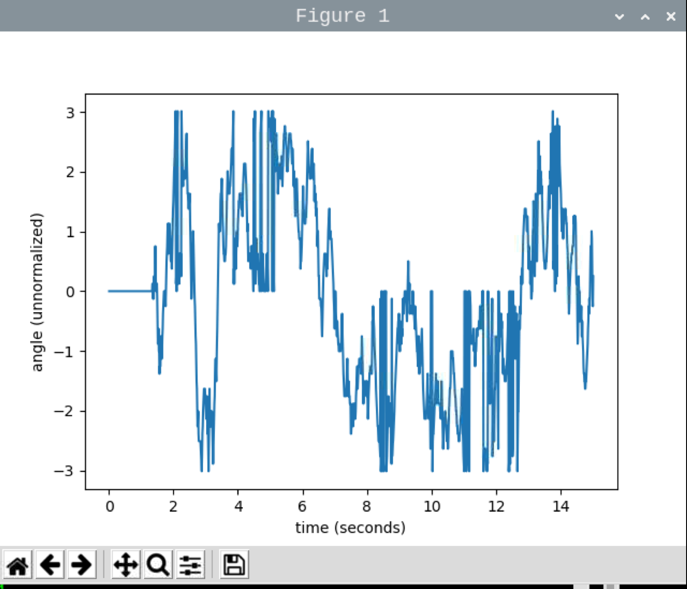

# Inverted Pendulum (Cart-Pole) Control
PHYS CS 15C, Spring 2021

Ganden Schaffner, Pierre Thibodeaux, Richard Yang

College of Creative Studies

University of California, Santa Barbara

# Introduction

[Krishnavedala, CC0, via Wikimedia Commons]

The inverted pendulum is an illustrative dynamical system useful for studying nonlinear behavior and control methods for underactuated nonlinear systems. While a standard pendulum has a center of mass below its pivot point, an inverted pendulum has a center of mass below its pivot point. Thus, while a standard pendulum has a natural stable equilibrium when the center of mass is directly below the pivot point, the inverted pendulum has an unstable equilibrium when the center of mass is directly above the pivot point. Any perturbation away from this equilibrium is amplified, causing the pendulum to fall away from the usntable equilibrium.

In order to balance the pendulum upright, we need a controller that applies force/torque to the system in response to displacement from equilibrium. In our system, the pivot is attached to a cart which we move with a motor to provide this force. We can read the angular position of the pendulum and feed that measurement to a controller to determine how to move the cart to keep the pendulum upright. We implemented this using Python 3 and a Raspberry Pi 4.

# List of Components
### Hardware
* 0.75 x 3.5 in x R/L ft poplar
* 0.25 x 5.5 in x 2 ft poplar board
* 0.25 x 1.8 in x 2 ft poplar strip
* 1m Linear rails + sliding carts
* GT2 Timing Belt + 5mm teeth pulleys wheels
* 8mm bore diameter ball bearing pillow block
* 6mm diameter ball bearing
* M6 x 80 mm partially threaded bolt
* M3, M4, M5 bolts and nuts
* Rotary tool
* Super glue
* Wood glue
* Panel saw
### Electronics
* Raspberry Pi 4
* HEDS-5505 Rotary Encoder
* NEMA-17 Stepper Motor
* Stepper Motor Bracket
* BIQU A4988 Motor Driver
* ALITOVE DC 12V 10A Power Supply
* Breadboard
* 1m Female-to-Male breadboard jumper wires
* Ring wire connectors
* 100 uF capacitor
* 3-prong power cord

# Design
## Cart-Pole Hardware Design
The hardware design for our cart-pole came primarily from [this Instructable](https://www.instructables.com/Inverted-Pendulum-Control-Theory-and-Dynamics/), though with large modifications.

There needs to be a cart, from which the pendulum pivots. This cart moves back and forth on a rail, being moved by a belt attached to the motor. Here is a preliminary design of the rail system:

The cart needs to have a wall to accomodate the pivot of the pendulum. The friction in the pivot is reduced by a ball bearing, through which the axle/shaft is fed. Using a thick wall with multiple contact points reduces torque on the system. On the inside wall, the encoder is fixed to measure the angular position of the pendulum. Here is a preliminary design of the pivot:

Here is an early, rudimentary 3D model of the whole system. The foreground version is truncated, with the pendulum removed, for visibility:

This model can be explored in 3D [here](https://www.tinkercad.com/things/0iKo4K6oQAa-inverted-pendulum-cart-simple-design). The cart design and overall design were modified, as will be evident in the result of the Building process section.

## Software Design
We chose to use a single-board computer (Raspberry Pi 4) for control rather than a microcontroller. A few factors went into this decision. First, we all had preexisting familiarity with Python but not with the Arduino language. While a microcontroller could provide a faster response time, there are many documented instances of working cart-pole balance controllers running on Raspberry Pi's, so the lower response time was not a major concern. More important to us was the speedup we would have from not having to learn a new language.

Our software consists of three main pieces:
* Our simulation of the system.
* Our controllers. These are not hardware controllers—they are controllers in the control theory sense. They are are boxes that take in state and output a float.
* Our hardware control code, the part that interacts with the physical circuitry.

Desired interoperability between these pieces also factored into our decision to write everything in Python. We wanted each controller to be modular so that it could be run on either simulation or on the actual hardware. We ended up adhering to this philosophy for one of our controllers, but the second was integrated directly into hardware control code since it would not have been feasible to test it on our existing simulation; more on this later.

## Circuit Design
The general circuit design is as follows:

The rotary encoder is connected to the RPI 5V and GND. Its Channel A, B outputs are sent to two GPIO pins to serve as inputs, specified in the code (here, 23 and 24).

The motor driver mediates the outputs from the RPI and translates it into motor movement. The motor driver STEP and DIR inputs are connected to the RPI through GPIO pins specified in the code (here 27 and 22), which respectively control the speed and direction of the motor. The driver is also connected to the ground and 5V pins of the RPI, to drive the logic inputs (STEP, DIR). Sleep and RESET on the driver are connected. The motor is connected to the driver at A1,B1,A2,B2. The driver is given DC power input from the power supply, which converts wall outlet AC voltage to usable DC voltage and steps it down to a useable voltage (120AC to 12DC). A capacitor is placed across the power supply voltage and its ground to prevent discharge when the system is disconnected, and to limit the current going into the motor.

An implementation is depicted here:

# Building Process
**Step 1: Linear rails**

The two ends of the linear rails are fixed to a large wooden block with mounting screws. The two linear rails must be parallel to each other so that the pendulum-cart assembly can freely slide. The distance between the two linear rails is 70 mm from end to end. Use a rotary tool to drill appropriate holes on the wooden blocks, and fix the rails on top with screws. See picture below.

**Step 2: Idle pulley and stepper motor mounting**

The idle pulley and stepper motor need to be at approximately the height as the metal carts, on which the pendulum is mounted. Slide the metal carts onto the rails and measure the height from the wooden block at the end of the rail to the top of the cart. This determines how much the pulley and/or stepper motor needs to be elevated. For our apparatus, a block of wood with a height of about 20 mm is placed between the idle pulley and the end wooden block. The stepper motor does not need any elevation.

A timing pulley wheel is used on both the shaft of the stepper motor and the idle pulley. For the stepper motor, the timing pulley directly locks onto its shaft. The idle pulley is constructed by putting a M4\*20 bolt through a pulley wheel with a nut locked on the other side. The nut is then fitted snugly into the pillow bearing block. See pictures for details.

The stepper motor is mounted with a stepper motor bracket onto the linear rails. A large rectangular piece of wood is cut out from the wood plank to give enough room for the motor to be placed with its timing pulley wheel in between the two rails. See picture for details.

**Step 3: Pendulum-cart assembly**

The pendulum is made by fixing the end of a 70mm long M6 shaft through one end of a long wooden strip. Use a rotary tool to drill a hole of suitable diameter for the shaft to fit in and make sure the hole is centered along the midline of the strip.

The shaft passes through two vertical side pieces. Cut out two rectangular pieces from the plank of wood with dimensions 70mm x 60 mm. Drill a whole in the center of each piece so that a M6 bearing can be embedded inside. See picture below for detail.

On the left side of the picture is the encoder base plate; in the middle is a side piece in the process of drilling a hole through it, and on the right is a finished side piece.

The two side pieces rest on top of a platform, which is in turn locked onto the rail carts. Cut out a 140 mm x 70 mm rectangle from the plank of wood for the platform. Drill a slit on the midpoint of the platform's longer side. This is where the timing belt will pass through in the later part.

The rotary encoder is super glued on one of the side pieces with the pendulum shaft passing through its optical disk. Make sure the shaft can pass freely through the side piece and the encoder. Be very careful with locking the rotary encoder onto the shaft! The rotary encoder is typically not designed to be dismounted from the shaft, which means you should lock the encoder after checking all parts of the pendulum-cart assembly are in place. Always check the datasheet and other information provided by the manufacturer before use. See schematics for details:

Use wood glue to attach the two sides pieces onto the platform. One side piece sits on a shorter side of the platform, and the other side piece is 30 mm inward and in parallel with the first one. Make sure the shaft can fit through the two side pieces and is in good orientation before applying wood glue to the side pieces.

Slide in the shaft through the two sides pieces and leave the entire threaded part outside (see schematics above). Lock the rotary encoder onto the shaft following the instructions provided by its manufacturer.

**Step 4: Putting everything together**

Slide the two rail carts onto the rails and mount the pendulum-cart assembly on top with screws. Wind the timing belt around the two pulleys and into the two slits of the platform. Next, mount the pendulum on the threaded part of the shaft. A washer and a nut should sandwich on either side of the pendulum. The hardware is assembled!

# Simulation and Control Theory
_N. B._ This section is written to accompany [derivation.pdf](derivation.pdf) (i.e. [derivation.tex](derivation.tex)), parts of which should be considered as part of this README. As we go through this, I will note when you should tab over to [derivation.pdf](derivation.pdf) to read a section there.

## Equation of Motion and Simulation
As simulation of the system was implemented based on a derivation of the cart-pole system's equation of motion. The equation of motion included terms for the control force `u(t)` applied to the cart. See the "Equation of Motion" section of [derivation.pdf](derivation.pdf) for this derivation. The first part of [derive.py](src/derive.py) also performs the last step of this derivation symbolically. It is not important that you read the entire "Equation of Motion" section of [derivation.pdf](derivation.pdf), but you should understand the equation of motion as written in manipulator form:

This equation was quite important in the development of a linear-quadratic regulator for the system, as we will describe soon.

Simulation of motion based on this derivation was implemented in [sim.py](src/sim.py), which relies primarily on `scipy.integrate.solve_ivp`. [sim.py](src/sim.py) can also render animations of the simulated system.

## Considered Types of Controllers
For balance control, we want a controller that minimizes the error vector

with some meaningful definition of "minimizes." We considered two major controller types for balance control, each with their pros and cons:

* PID controller
    * Con: Can be tedious to tune
        * Up to 3 * N_inputs constant parameters in general.
            * With our error vector, redundancy between integrals and derivatives means that this would be up to 8 parameters to tune. In practice, a few of these would be unimportant and set to zero, so there would be 3–5 parameters to tune.
        * Navigating parameter space can be finnicky when one is trying to tune.
    * Pro: Does not require explicit knowledge of the system's governing differential equation.
        * Widely applicable to many systems.
* Linear-quadratic regulator (LQR)
    * Pro: Much easier to tune
        * Up to N_inputs * (N_inputs + 1) + 1 constant parameters in general.
            * In practice, good controllers need only N_inputs nonzero parameters. For us, this is 5. This is actually effectively only 4, however, since the relative scaling of an LQR's parameters does not affect the resulting controller.
        * The parameter space is "smoother," loosely speaking. It's much less finnicky to navigate than a PID's parameter space usually is.
    * Con: Requires knowledge of the system's (linearized) governing differential equation (the equation of motion, in our case).
        * ⇒ Applicable to fewer systems.

## Deriving a Linear-Quadratic Regulator (LQR)
We decided to try using an LQR for balance control before trying a PID, as we expected an LQR would be much easier to tune than a PID controller. We also already had familiarity with PID's and wanted to take the opportunity to explore something new.

Unlike a PID controller, an LQR requires knowing the system's equation of motion, linearized about the equilibrium that we want the system to balance at. This linearization is detailed extensively in Section 2 of [derivation.pdf](derivation.pdf), with symbolic calculations done in [derive.py](src/derive.py). Here I will just describe the general gist of the derivation.

First, the state vector `s` was used to push the equation of motion down to first order: in block notation,

To linearize this about the unstable equilibrium (`s^*`, `u^*`), we then calculated the Jacobians

yielding the linearized equation of motion

An LQR then uses the linear control law

to minimize the cost function

where `Q`, `R`, and `N` are parameters that one must tune. Note that this cost is a time-integrated quadratic form. Noting that the vector `u` has only one nonzero component, we have 4 * x + 1 + 4 = 21 parameters to tune here.

In practice, however, we don't need all of this generality. Please read the discussion of this at the end of Section 2 of [derivation.pdf](derivation.pdf). The result is that we only have 5 important parameters to choose: the diagonal of `Q`, and a scalar `R`. Each element `Q_{ii}` weights the penalty assigned for error in the component `e_i`, while the scalar `R` penalizes the control and keeps it from being overly large.

The matrix `K` is then calculated by solving the continuous-time algebraic Riccati equation, which can be done numerically. Even though an LQR is actually just a proportional controller, which can have problems with overshooting their set point, the time integral in the LQR's cost function means that the controller will do a good job at preventing overshoot.

## Results of LQR on Simulation
Tuning the parameters for the LQR was incredibly easy. It took only perhaps an hour to find a set of parameters that work very well in simulation, with most of the time during tuning being spent waiting for simulated animations to render. Compare this to how long it has probably taken you to tune PID's in the past.

Furthermore, the performance of the controller did not vary significantly when the LQR parameters were perturbed. This is the aforementioned "smoothness," which is best seen from the fact that LQR parameters are _penalties_ on different types of errors away from equilibrium. A PID's parameters, on the other hand, are coefficients in the actual _response_ of the controller. When tuning a PID controller, one is directly setting coefficients in the controller's response. But LQR takes a step back into a more abstract space, where one tunes _penalties_ for error rather than tuning what the actual _response_ should be itself. This step back into a nicer parameter space is only possible because an LQR has knowledge of the system's equation of motion.

[Here](images/lqr-sim/00-deg,pi-on-2-radps.mp4) is an example of the LQR working in simulation. It works nicely and doesn't overshoot the center of the track too much when returning to the desired set point there.

Note that the lengths, masses, etc. used in simulation match to the dimensions of the hardware we built. Do note, however, that the tip of the pendulum, as displayed in simulated animations, is actually the center of mass of the pendulum. The real pendulum is about twice as long as it naïvely appears to be in the animations.

Let's now look into the performance of the LQR. In particular, let's look at two cases: response to an initial angular displacement (with no angular velocity or cart velocity), and response to an initial angular velocity (with no angular displacement or cart velocity).

## LQR Performance: Initial angular displacement

For each initial angular displacement `theta_0`, we simulated the system with LQR control applied. For each `theta_0`, we took note of the maximum force and the track length that the controller used to stabilize the pendulum.

We found that the controller could stabilize initial angles up to about 75 degrees. This was very impressive—remember, the LQR is has "knowledge" of the _linearized_ equations of motion, _linearized_ about the set point. 75 degrees is well out of the `sin(theta) = theta` range, so it's rather incredible that the controller works this far out.

Note that the above plot is linear, except at large `theta_0`. Since the controller is linear, the control applied at `t = 0` is linear in `theta_0`. So a linear plot would occur if the controller was applying the maximum force at `t = 0`. This is in fact the case! This is a sign of a good controller, showing that it doesn't underreact to the initial condition.

In contrast, the nonlinearity that we observe at initial `theta_0` near the limit of what can be controlled means that at large `theta_0`, the controller applies the maximum force at `t > 0`. This isn't good. It means that the controller is underreacting to these large initial angular displacements and allowing the pendulum to continue falling over too quickly. As the pendulum falls over too quickly, the system state becomes "worse" than it was initially. The controller then realizes this and has to an apply an even stronger force than it did before. The nonlinearity that we can see at initial angular displacements near the controllable limit is because at these initial conditions, the controller could just barely take control of the system! And note that as `theta_0` increases up to the maximum controllable limit, the plot diverges even farther from linearity. At just above 75 degrees, the controller stops being able to take control of the system entirely—the initial angular displacement is just too extreme.

A similar figure was made showing the track length that the controller used for each initial `theta_0`:

Note that, while the controller can stabilize initial angular displacements of up to about 75 degrees, our actual track is only 1 meter long, allowing only about 20 degrees: [see animation](images/lqr-sim/20-deg,0.0-radps.mp4). This is still pretty good.

## LQR Performance: Initial angular velocity

We also did the same sort of performance analysis for the case of initial angular velocities (without initial angular displacement or cart velocity).

The controller could stabilize initial angular velocities up to about 1300 deg/s, or about 3.6 rev/s. Again, this is quite impressive!

The above figure is entirely linear, all the way up to the controllable limit (unlike the maximum force figure for initial angular displacements). Linearity indicates that the controller is not underreacting to the initial angular velocity, which is good. But the _lack_ of nonlinearity near the maximum controllable limit is curious, and we haven't come up with an explanation for why there isn't a bit of nonlinearity present near this limit.

A similar figure was made showing the track length that the controller used for each initial `omega_0`:

This figure is rather interesting, for a few reasons. First, the linearity observed throughout of this track length figure is not something that we have a good physical explanation for! The length of track that the controller uses to stabilize the pendulum is just something that pops out the numerical integrals in our simulation! There doesn't seem to be an explanation for it via something like energy conservation, as the force applied by the controller is variable and depends on the system state, and the displacement over which this force is applied also depends on the system state, which is something with no nice analytic form that we must just numerically integrate for. If you manage to come up with a compelling explanation of this unexpected linearity, please let us know!

In the figure above, the behavior observed at initial `omega_0` near the controllable limit is also interesting. We can see that the track length used to stabilize the pendulum has a peculiar dip, and then it blows up. The dip is not something that we have been able to determine a physical explanation for. The explosion, on the other hand, has a nice interpretation. If one watches the animations of these simulated trials, the explosion is clearly associated with the onset of a huge overshooting of the set-point past some critical-ish value of `omega_0`. That is: if we increase `omega_0` past the threshold seen in the figure above, the pendulum is initially falling to the left very quickly, so the controller pushes the cart left to chase it. The forced cart makes its way under the pendulum in order to begin pushing the pendulum to the right, to catch the pendulum and move back toward the equilibrium at the center of the track. At most `omega_0`, the controller does a good job at this, with minimal overshoot of the track's center when rebounding. But past the critical-ish threshold value of `omega_0`, the controller almost loses control of the system while it pushes the system back to the center of the track. This causes an overshooting of the center. Below `omega_0` of about 1300 deg/s, this overshoot is still recoverable and the controller eventually succeeds at bringing everything back to the center. But above a quite high `omega_0` of around 1300 deg/s, the initial angular velocity is just too extreme for the controller to handle.

The final thing that we would like to note here is that while the controller can stabilize initial angular velocities of up to about 1300 deg/s in simulation, our actual track is 1 meter long, allowing only about 90 deg/s: [see animation](images/lqr-sim/00-deg,pi-on-2-radps.mp4). This is still pretty good.

# Hardware Control Code
## Input/Output
Generally, the design of the code is that we want to take in a reading from the encoder, do some action on that measurement to inform how the motor should move, and then tell the motor how to move that way.

The reading from the motor is handled by the [Encoder library](https://pypi.org/project/Encoder/) which translates the encoders quadrature-encoded signal into a single int, where the magnitude represents angular displacement from the start-up position, and sign represents the net direction of that displacement. This is converted into an angle measurement from equilibrium for use by the controller.

The action is determined by the controller, which takes in the current state of the system and returns an acceleration/force for the motor to perform. This is discussed in the previous section.

The stepper motor moves a finite "step" for every time-spaced pulse that is fed to it. Thus by manipulating the number of pulses we feed to the driver in a given time step, we can manipulate how fast the motor spins. The direction the motor should move in is determined by the sign of the intended force, and is fed to DIR. The magnitude is converted into a number of pulses, making sure to limit this number so as not to exceed the maximum torque/speed of the motor. The pulses (and direction) are generated using the [RPi.GPIO Library](https://pypi.org/project/RPi.GPIO/) and manually turned on and off to make the voltage high/lows that move the motor.

## Enumeration of Source Files
* [derive.py](src/derive.py) does symbolic calculations as discussed in [derivation.tex](derivation.tex)
* [sim.py](src/sim.py) generates the simulations and animations used to test the LQR
* [lqr.py](src/lqr.py) implements a LQR for balance control
* [measuremoment.py](src/measuremoment.py) records the (approximately) sinusoidal oscillation behavior of the free-swinging pendulum to calculate the moment of inertia of the pendulum
* [movemotor.py](src/movemotor.py) moves the motor a distance according to user input
* [drivesin.py](src/drivesin.py) moves the pendulum in a sinusoidal pattern to test motor control and to examine resonant behavior
* [encoder2motor.py](src/encoder2motor.py) uses a LQR to drive the system based on the encoder reading
* [encoder2pid.py](src/encoder2pid.py) uses a PID balance controller to drive the system based on the encoder reading

# Testing
As a preliminary testing of the hardware, we supplied the stepper motor with a sinusoidal driving function and recorded the pendulum's oscillation.

Sinusoidal driving at a random frequency.

Sinusoidal driving at the pendulum's measured natural frequency, 0.80 Hz. The system exhibits resonance.

The rotary encoder experiences a drift as the pendulum rotates.

The figure above shows significant drifting in angle measurement during free oscillation of the pendulum around 20 degrees. (ignore the units on the y-axis). The figure also suggests that the optical disk tends to be "stuck" at one place as the axle of the pendulum rotates.

This is because we dismounted the rotary encoder from a shaft that was used for testing purposes. The actual shaft intended for the encoder was delayed for delivery until week 8 of the quarter. As it turns out, the rotary encoder is designed to be locked permanently to a shaft. The dismounting and reinstalling of the shaft causes the slippage issue between the new shaft and the optical disk inside the encoder.

Our testing also shows that the stepper motor is not able to correct the falling pendulum to within an appreciable amount of initial angular displacement. [Click here](https://drive.google.com/file/d/1BHcrjFQCVGA6YQBz7S_OSBysZSyTQeNV/view?usp=sharing)

# Results/Analysis
Overall, our pendulum controller was able to correctly dictate the action that the motor should perform in order to fix the motion of the pendulum. However, the data we took involved Richard keeping his hands near the pendulum to prevent it from falling too far. As will be discussed, the system is unable to maintain equilibrium on its own. Here we can see a trial using the LQR:

Of note here are the purple and red curves. Purple represents intended motion of the motor, in pulses per timestep, as calculated by the controller. Red represents the approximate velocity of the cart based on the actual pulses delivered to the motor. The blue curve is the angular displacement from t = 0. Since we start the pendulum in its upright position, the blue curve is the angular deviation from the unstable equilibrium, and is the object the controller is trying to minimize. The blue and purple curves are almost always anticorrelated, which shows that the LQR is trying to balance the pendulum.

The difference between the purple and red curve is because we impose a maximum speed of the motor above which the motor ceases to work. We can see that in this plot, the red curve is bounded, but the purple curves exceed these bounds. Thus, we can conclude that the controller is ordering the motor to move above a certain speed that the motor cannot achieve.

This is reinforced in other tests that we performed. In [this video](https://drive.google.com/file/d/1BHcrjFQCVGA6YQBz7S_OSBysZSyTQeNV/view?usp=sharing) it can be seen that the motor has difficulty moving faster than the falling pendulum.

This is a limitation of our hardware. It is possible that using a pendulum with a higher moment of inertia would lessen the effect of this issue, as the pendulum would rotate slower compared to the motion of the motor. We could also use a faster motor, or try to use a larger pulley to translate the same angular velocity into a larger linear velocity of the cart.

Something to note here is that the LQR's theoretical design does not perfectly match our hardware. Ganden developed the LQR controller, but did not realize until too late that our choice to use a stepper motor rather than another type of motor meant that with our system, we actually control the cart's velocity, not the position. For example, if the stepper motor is powered off, the cart does not move freely; it is fixed, and the pendulum becomes a fixed-axis pendulum. Had the project been completed in person rather than with the other two group members unable to physically touch the hardware that Richard built, we would have realized this problem much sooner.

Because the LQR is theoretically flawed for our hardware, we tested a PID controller as well. This would not have solved the hardware issue, but we tried anyway.

The purple curve is anticorrelated with the blue curve, indicating that the PID controller is basically opposing the position of the pendulum, meaning that it is dictating the motor's motion correctly. However, the system seems to have a noticeable lag, and was ultimately unable to keep the pendulum upright. As expected, the change to the PID was not itself enough to make the system work.

# Issues/Error Analysis/Improvements
The motor does not really move fast enough for simple feedback control. As in, there is a maximum speed of the motor, and this speed is below what is necessary (for the pendulum we used) to correct displacements from equilibrium. The displacements are defaultly positive feedback, so the system needs to be able to react quick enough and move fast enough to outpace this. You could imagine that the bottom of the pendulum needs to move faster than the top of the pendulum in order for it to be returned to an upright position. This is not achievable with our motor. In order to correct this, we would probably want a motor with a higher maximum angular velocity. Using a larger pulley in our belt system could also turn the angular velocity of the motor into a higher linear velocity. It is also possible that a system with a larger moment-of-inertia per mass would move slower, and therefore, our motor would be able to respond quicker in comparison. This would require a pendulum of a different shape.

The rotary encoder experiences drift, as in, moving the encoder moves the angular position of the zero point. This is more profound for larger and more violent angular displacements then for small motions. This might be a consequence of taking apart the rotary encoder, as the HEDS-5505 is not meant to be taken apart, but we did anyways. To overcome this, we would ideally use another rotary encoder that does not have this issue. Using the same flawed encoder, we would want some method to reset the zero point, either manually, or based off of markers of the system (for example, based on the oscilliatory behavior of the system).

The pulse delivery system of the code is imperfect. Manually turning on and off the GPIO outputs might be slow or computationally inefficient, causing the system to react unideally. We would probably want to use the PWM functions in the RPi.GPIO library, though in the course of this project, we could not figure out how to make that work with our devices.

The remote setting of our group also proved to be a challenge for this project. The three members of the group are all in different locations: Isla Vista, San Luis Obispo, and Los Angeles. The hardware was solely constructed in Isla Vista, while the two other group members focused on simulation and coding. This inevitably delayed the construction of apparatus, and made troubleshooting more cumbersome when the system was set up. The lack of physical contact with the apparatus means it was in general harder for the remote members to fully gauge the system's behavior. Coupled with the logistic issue that the shaft of the pendulum was delayed and did not arrive until week 8, the lab apparatus was only constructed on week 8. This left very little time for integrating the hardware with the hardware control code and control (theory) code, testing, troubleshooting, and collecting data.

# Acknowledgements
We'd like to thank Andrew Jayich, Mingyu Fan, and Sean "Beaks" Buechele for their suggestions, ideas, and time throughout the quarter.

We'd also like to extend our thank to the authors, contributors, and maintainers of the following open source and/or free software projects:
* the Python language
* NumPy & SciPy
* Matplotlib
* SymPy
* [RPi.GPIO](https://sourceforge.net/projects/raspberry-gpio-python/)
* [Encoder](https://github.com/mivallion/Encoder)
* Black, isort, Flake8, & Flake8-bugbear

# References
* https://www.instructables.com/Inverted-Pendulum-Control-Theory-and-Dynamics/
* https://projekter.aau.dk/projekter/files/243991610/Swing_up_Control_of_an_Inverted_Pendulum.pdf
* https://doi.org/10.1016/j.promfg.2018.06.004
* https://doi.org/10.3182/20110828-6-IT-1002.01985
* https://create.arduino.cc/projecthub/zjor/inverted-pendulum-on-a-cart-199d6f
* https://ocw.mit.edu/courses/electrical-engineering-and-computer-science/6-832-underactuated-robotics-spring-2009/readings/MIT6_832s09_read_ch03.pdf
